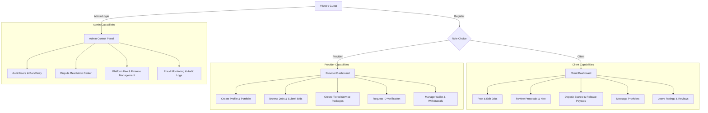
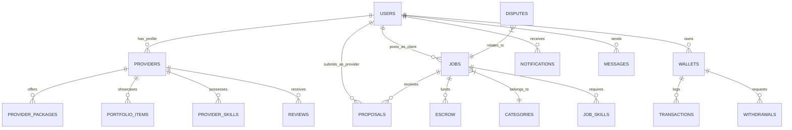
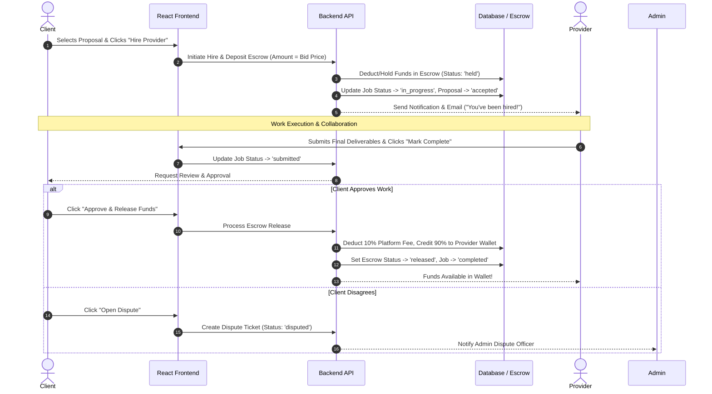

# GigGhana — Technical Documentation & React Migration Blueprint

> **Product Vision**: A modern, localized freelancing and gig economy marketplace tailored for Ghana. GigGhana connects clients (businesses, individuals) with verified local talent (developers, designers, artisans, writers, media producers, consultants) using localized currency (GH₵ / GHS), escrow protection, and mobile money integration.

---

## 📄 Executive Summary & Core Idea

**GigGhana** provides a secure, streamlined platform for hiring Ghanaian freelancers and service providers. It solves local payment friction, trust barriers, and verification challenges through:
- **Localized Payments & Escrow**: Escrow protection built around Ghanaian payment methods (Mobile Money - MTN MoMo, Telecel Cash, AT Money, Bank Cards).
- **Identity Verification**: Tiered user verification using Ghana Card / National ID to combat fraud and build client trust.
- **Dual Marketplace**:
  1. **Job Board (Client-Driven)**: Clients post project briefs with budget ranges; providers submit competitive proposals.
  2. **Service Gigs (Provider-Driven)**: Providers package fixed-price services (Basic, Standard, Premium) with defined deliverables.
- **Integrated Wallet & Disputes**: Escrow deposits, automatic platform fee calculation (10%), dispute resolution center, and withdrawal tracking.

---

## 🛠️ Recommended Modern Tech Stack for React Build

| Layer | Recommended Technology | Rationale |
| :--- | :--- | :--- |
| **Frontend Framework** | **React (Vite)** or **Next.js 14+ (App Router)** | High performance, SEO for public job listings, fast client-side transitions. |
| **Styling & UI** | **Tailwind CSS** + **Shadcn UI** + **Lucide Icons** | Premium aesthetic, dark/light mode support, responsive micro-animations. |
| **State Management** | **TanStack Query (React Query)** + **Zustand** | Server state caching for live job updates; lightweight UI state store. |
| **Backend & Database** | **Supabase** (PostgreSQL) or **Node.js / Express + MySQL** | Real-time messaging/notifications, built-in Row Level Security (RLS) & Auth. |
| **File Storage** | **Supabase Storage** or **AWS S3 / Cloudinary** | Avatars, portfolio images, verification ID documents, job attachments. |
| **Realtime Engine** | **Supabase Realtime** or **Socket.io** | Instant chat messaging, notification badges, live job application feeds. |

---

## 👥 User Roles & Access Control



---

## 🗄️ Database Schema & Data Models

Below is the complete entity-relationship model distilled from the system's core database tables.



### Core Table Definitions

#### 1. `users`
- `id` (INT / UUID, Primary Key)
- `first_name`, `last_name`, `email`, `phone`, `password_hash`
- `role`: ENUM (`'client'`, `'provider'`, `'admin'`)
- `avatar`: String (URL)
- `location`: String (e.g., "Accra, Ghana", "Kumasi, Ghana")
- `is_active`: Boolean (Default: `1`)
- `is_banned`: Boolean (Default: `0`)
- `created_at`, `updated_at`

#### 2. `providers`
- `id` (INT / UUID, PK)
- `user_id` (FK -> `users.id`)
- `tagline`: String (e.g. "Senior Full-Stack Developer & UI Designer")
- `bio`: Text
- `hourly_rate`: Decimal (GHS)
- `experience_level`: ENUM (`'entry'`, `'intermediate'`, `'expert'`)
- `availability`: ENUM (`'full_time'`, `'part_time'`, `'contract'`)
- `rating_avg`: Decimal (0.00 to 5.00)
- `rating_count`: INT
- `completed_jobs`: INT
- `is_verified`: Boolean (Ghana Card / ID verification flag)
- `is_featured`: Boolean

#### 3. `jobs`
- `id` (INT / UUID, PK)
- `client_id` (FK -> `users.id`)
- `category_id` (FK -> `categories.id`)
- `title`: String
- `description`: Text
- `budget_type`: ENUM (`'fixed'`, `'hourly'`)
- `budget_min`: Decimal
- `budget_max`: Decimal
- `status`: ENUM (`'draft'`, `'open'`, `'in_progress'`, `'completed'`, `'cancelled'`)
- `is_urgent`: Boolean
- `is_featured`: Boolean
- `proposal_count`: INT
- `created_at`, `updated_at`

#### 4. `proposals`
- `id` (INT / UUID, PK)
- `job_id` (FK -> `jobs.id`)
- `provider_id` (FK -> `users.id`)
- `bid_amount`: Decimal
- `delivery_days`: INT
- `cover_letter`: Text
- `status`: ENUM (`'pending'`, `'shortlisted'`, `'accepted'`, `'rejected'`)
- `created_at`

#### 5. `escrow` & `wallets`
- **`wallets`**: `id`, `user_id`, `balance`, `escrow_balance`, `total_earned`, `total_spent`
- **`escrow`**: `id`, `job_id`, `client_id`, `provider_id`, `amount`, `status` (`'held'`, `'released'`, `'refunded'`, `'disputed'`)
- **`transactions`**: `id`, `wallet_id`, `amount`, `type` (`'deposit'`, `'escrow_hold'`, `'escrow_release'`, `'withdrawal'`, `'fee'`), `net_amount`, `status`

#### 6. `conversations` & `messages`
- **`conversations`**: `id`, `job_id`, `client_id`, `provider_id`, `last_message_at`
- **`messages`**: `id`, `conversation_id`, `sender_id`, `message_text`, `attachment_url`, `is_read`, `created_at`

#### 7. `verifications` & `disputes`
- **`verifications`**: `id`, `user_id`, `id_type` (`'ghana_card'`, `'passport'`, `'drivers_license'`), `id_number`, `document_url`, `status` (`'pending'`, `'approved'`, `'rejected'`)
- **`disputes`**: `id`, `job_id`, `raised_by_id`, `reason`, `description`, `status` (`'open'`, `'resolved'`, `'closed'`), `resolution_notes`

---

## 💻 Page-by-Page UI Specification & Features

### 1. Landing & Navigation (`/`)
- **Hero Section**: Search bar with real-time category autocomplete, popular tags, platform statistics (Active Providers, Open Jobs, Completed Gigs, Total Payouts in GH₵).
- **Categories Grid**: Interactive category cards with icons (Web Dev, Mobile Apps, Graphic Design, Digital Marketing, Writing, Video Editing, AI & Data).
- **Featured Providers**: Carousel/Grid showcasing top-rated verified Ghanaian freelancers with ratings, hourly rates, and skills tags.
- **Latest Jobs Feed**: Live stream of recently posted projects with urgent/featured badges.
- **Trust & Security Banner**: Explaining Ghana Card verification & Escrow protection.

### 2. Job Search & Filtering (`/jobs`)
- **Sidebar Filters**: Category multi-select, budget range slider, budget type (Fixed vs Hourly), urgency filter, experience level, location.
- **Job Cards**: Title, category badge, budget range (`₵500 - ₵1,500`), urgent tag, time ago, proposal count, short snippet.
- **Sorting**: Newest, Highest Budget, Most Proposals.

### 3. Job Details & Proposal Submission (`/jobs/:id`)
- **Job Header**: Title, Client verification badge, Location, Budget, Date posted.
- **Job Description**: Full scope, required skills tags, attached files.
- **Client Info Sidebar**: Client rating, total jobs posted, hire rate, member since.
- **Proposal Form (Provider View)**: Bid amount input, estimated timeline (days), cover letter editor, file attachment uploader, platform fee calculator preview (shows net payout after 10% fee).

### 4. Provider Directory & Profile (`/providers`, `/providers/:id`)
- **Directory Filters**: Skill filter, hourly rate slider, rating filter, availability, verified-only toggle.
- **Profile Header**: Avatar, Full Name, Tagline, Location, Hourly Rate, Ghana Card Verified badge, "Hire Me" / "Message" action buttons.
- **Profile Tabs**:
  - **Overview**: Bio, top skills, experience level, work history.
  - **Service Packages**: Basic / Standard / Premium packages table with price, delivery time, revisions, and feature checklists.
  - **Portfolio Gallery**: Grid of completed projects with modal image view.
  - **Reviews & Ratings**: Client reviews with star breakdowns.

### 5. Client Portal (`/client/*`)
- **Client Dashboard** (`/client/dashboard`): Active job counters, total spent, pending proposals awaiting review, recent messages.
- **Post a Job** (`/client/post-job`): Step-by-step form (Category -> Title & Specs -> Budget & Timeline -> Skills -> Publish).
- **My Jobs** (`/client/jobs`): Tabbed management (`Open`, `In Progress`, `Completed`, `Drafts`).
- **Proposal Review & Hiring** (`/client/jobs/:id/proposals`): Compare provider quotes, view provider profiles, initiate escrow payment to hire.
- **Client Wallet & Escrow**: View funded escrows, approve completed work to release escrow, view transaction receipts.

### 6. Provider Portal (`/provider/*`)
- **Provider Dashboard** (`/provider/dashboard`): Active proposals, ongoing projects, total earnings (`GH₵`), profile completeness meter.
- **Proposal Tracker** (`/provider/proposals`): Submitted bids, status updates (`Shortlisted`, `Accepted`, `Declined`).
- **My Service Packages / Gigs**: Create and edit tiered packages.
- **Earnings & Withdrawals** (`/provider/earnings`): Available balance, pending escrow balance, withdrawal request modal (MTN MoMo, Telecel Cash, Bank Account).

### 7. Real-Time Messaging (`/messages`)
- Split-pane interface (Conversation list on left, active chat stream on right).
- Associated job context card header.
- File attachment preview, read receipts, real-time typing indicators.

### 8. Admin Control Panel (`/admin/*`)
- **Dashboard**: Total platform volume (`GH₵`), active dispute count, user growth chart, pending ID verifications.
- **User Management**: Search users, toggle active/banned status, review Ghana Card documents for badge approval.
- **Dispute Resolution**: View contract messages, job deliverables, refund escrow to client or release to provider.
- **Financial Audit**: Transaction log, platform fee revenue summary.

---

## ⚡ Core Business Workflows & State Machines

### 1. Escrow & Hiring Lifecycle



---

## 📁 Recommended React Project Folder Structure

```
src/
├── assets/                  # Static graphics, logos, illustrations
├── components/
│   ├── ui/                  # Reusable atomic UI (Buttons, Inputs, Modals, Cards, Badges)
│   ├── layout/              # Navbar, Footer, Sidebar, PageContainer
│   ├── jobs/                # JobCard, JobFilters, ProposalModal, PostJobForm
│   ├── provider/            # ProviderCard, PackageTable, PortfolioGrid, SkillBadge
│   ├── messaging/           # ChatList, MessageBubble, ChatInput
│   └── wallet/              # TransactionHistory, WithdrawalModal, EscrowCard
├── context/                 # AuthContext, NotificationContext, SocketContext
├── hooks/
│   ├── useAuth.ts           # Login, logout, session state
│   ├── useJobs.ts           # React Query job fetchers/mutations
│   ├── useProposals.ts      # Proposal submission and hiring hooks
│   ├── useWallet.ts         # Balance and withdrawal hooks
│   └── useChat.ts           # Realtime chat messaging hook
├── lib/
│   ├── api.ts               # Axios / Fetch client instance with auth headers
│   ├── supabase.ts          # Supabase client initialization (if using Supabase)
│   ├── formatters.ts        # Currency (GH₵), date formatters (timeAgo)
│   └── validators.ts        # Zod schemas for forms (job posting, profile edit)
├── pages/
│   ├── Home.tsx             # Public landing page
│   ├── Jobs.tsx             # Browse jobs page
│   ├── JobDetails.tsx       # Single job view + proposal form
│   ├── Providers.tsx        # Browse provider directory
│   ├── Profile.tsx          # Provider public profile page
│   ├── auth/
│   │   ├── Login.tsx
│   │   ├── Register.tsx
│   │   └── VerifyOTP.tsx
│   ├── client/
│   │   ├── Dashboard.tsx
│   │   ├── PostJob.tsx
│   │   └── Proposals.tsx
│   ├── provider/
│   │   ├── Dashboard.tsx
│   │   ├── Earnings.tsx
│   │   └── SubmitProposal.tsx
│   └── admin/
│       ├── Dashboard.tsx
│       ├── Users.tsx
│       └── Disputes.tsx
├── App.tsx                  # Router setup (React Router v6)
└── main.tsx                 # App entry point
```

---

## 🔗 Key API Contracts for Developer Reference

### Authentication
- `POST /api/auth/register` — `{ email, password, role, first_name, last_name, phone }`
- `POST /api/auth/login` — `{ email, password }` -> Returns `{ user, token }`
- `POST /api/auth/verify-otp` — `{ phone, code }`

### Jobs & Proposals
- `GET /api/jobs?category=&budget_type=&search=` — Paginated list of open jobs
- `POST /api/jobs` — Create new job post
- `POST /api/jobs/:id/proposals` — Submit proposal `{ bid_amount, delivery_days, cover_letter }`
- `POST /api/proposals/:id/hire` — Hire provider and fund escrow

### Wallet & Payments
- `GET /api/wallet/balance` — Returns available balance and held escrow balance
- `POST /api/wallet/withdraw` — `{ amount, payout_method: 'momo', phone_number, network: 'MTN' }`

---

## 💡 Key Design & UX Guidelines for Developer
1. **Localization First**: All monetary values must format automatically in Ghanaian Cedi (`GH₵` or `GHS`), e.g. `GH₵ 1,250.00`.
2. **Mobile-First Responsive Layout**: A significant percentage of Ghanaian freelancers and clients browse via smartphones. Ensure all dashboards, job feeds, and chat interfaces are fully optimized for mobile touch screens.
3. **Trust Indicators**: Visually highlight the **Ghana Card Verified** badge (`is_verified = true`) with a distinctive green checkmark badge across all provider listings.
4. **Optimistic Updates**: Use React Query optimistic updates for messages, proposal saves, and job bookmarks for an instant, smooth user experience.
